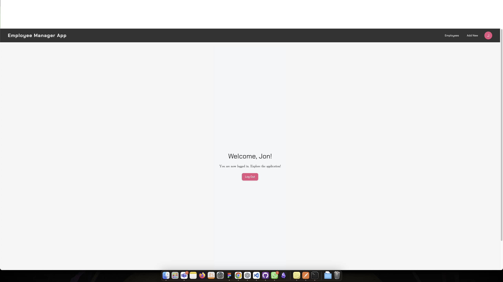
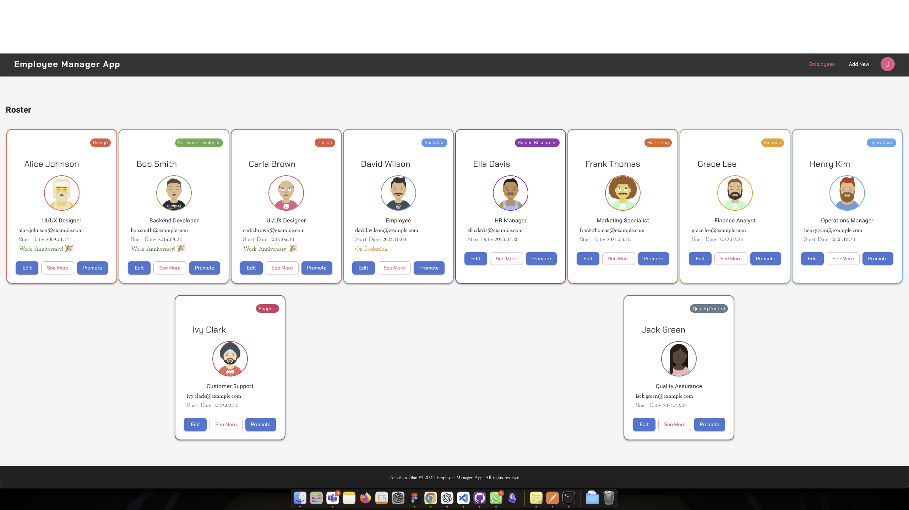

# HR Management App

 **When launching the app for the first time it will take up to a minute for the backend server to start sending data. Just be patient after clicking login**

#

This project is a full-stack React application created as part of a school project to learn full-stack development with React. The app is designed to manage employees efficiently, including adding, editing, and viewing employee details.

##

### Features

- <span class="highlight">Employee Management:</span>
  -     View a list of all employees.
  - Add new employees with key details.
  - Edit existing employee information.
  - Promote employees with role-based logic.
-     <span class="highlight">Mock User Login System:</span>
  - A simple login system that authenticates users based on credentials stored in the backend mock server.
  - Includes pre-defined users with usernames and passwords for testing.
  - Different users experience personalized views (e.g., a custom welcome message for the user “Margit”).
-     <span class="highlight">React Concepts:</span>
  - State management for dynamic updates.
  - Component-based architecture.
  - Props for passing data between components.
-     <span class="highlight">Backend Integration:</span>
  - Connected to a JSON server hosted on Render for data persistence.
  - Fetch and update employee and user data in real time.

##

### Goals

The primary goal of this project was to:

- Learn the basics of full-stack development with React.
- Implement a functional UI to interact with a backend server.
- Gain hands-on experience with state management and props in React.

## Technologies used

Built with:

- <span class="highlight">React</span>: Frontend library for building the user interface.
- <span class="highlight">JSON Server</span>: Mock backend to handle API requests.
- <span class="highlight">Render</span>: Hosting the backend mock server.
- <span class="highlight">CSS</span>: For basic styling and layout.
- <span class="highlight">JavaScript (ES6+)</span>: For component logic and interactivity.
- <span class="highlight">Vite</span>: Fast development server and build tool.
- <span class="highlight">**Axios**</span>: Library for making API calls, simplifying HTTP requests and responses.

#

Predefined Users

- Admin:
  - Username: admin
  - Password: 1234
- Developer:
  - Username: Jon
  - Password: dev
- Special User:
  - Username: Margit
  - Password: foxes

## Setup and usage

To run project locally:

1.  Clone repository

```bash
git clone https://github.com/JonathanGian/Employee-Manager-App.git
cd Employee\ Manager\ App/
```

2.  install dependencies:

```bash
npm install
```

3.  Start development server:

```bash
npm run dev
```

4.  Open the app in your browser at http://localhost:5173.

### Live page [here](https://jonathans-hr-app.netlify.app/)

## Screenshots



asdfasdf
## Sources

- [GitHub Guides - masterin markdown](https://guides.github.com/features/mastering-markdown/)
- [Make a README](https://www.makeareadme.com/)

## Authors and acknowledgment

<span class="highlight2">Margit Tennosaar</span>

- [GitHub](https://github.com/margittennosaar)
- [LinkedIn](https://www.linkedin.com/in/margittennosaar/)

Special thanks to my school and instructors for guiding me through this project.

## Sources and References

- React Documentation
- JSON Server Guide
- Vite Documentation

<style>
    .highlight{
        color: yellow;
        font-weight: bold;
    }
    .highlight2{
        color: lightblue;
        font-weight:bold;
    }

</style>
